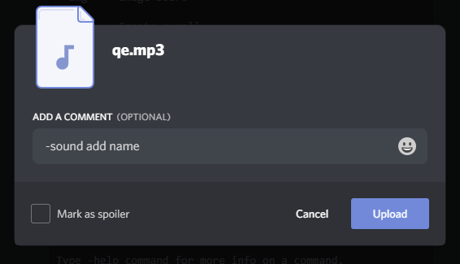

# simple-discor-bot

<a href="https://www.python.org/downloads/">
  
</a>
<a href="https://github.com/Rapptz/discord.py">
  
</a>


A simple Discord Bot made in Python 🐍🐍

This Bot provides a couple of fun and cool commands, along with a custom **soundboard** and **image gallery**.

## Commands

Full list `-help`

| Command | Description |
| ------ | ------ |
| dice | roll a dice |
| gift | offers a gift  |
| pray | pray respect |
| img | image board |
| sound | sound board |
| poll | create a poll |
| advice | looking for advice |
| btc | btc price |
| cat | random cat |
| dog | random dog |
| dadjoke | random dad joke |
| insult | evil insult generator |

## Upload
You can use an **URL** or **upload** a file.
Example with sound:

`-sound add <name> <url>`
or
`-sound add <name>`



## Docker
### Development Enviroment
Create an **.env** file with:
```
API_KEY=[api key]
SAVE_PATH=[path to save files]
ACTIVITY_MSG=[bot activity message]
MANAGER_ROLE=[management role]
```

#### VS Code + [WSL Containers](https://code.visualstudio.com/docs/remote/containers)

 - Remote-Containers: Reopen Folder in Container

#### Docker Compose

 - `docker-compose run --rm -w /workspace/bot/app/ simplediscordbot bash`
 
#### Run

 - `python bot.py`

### Build

Build the docker image:

`docker build .`

Deploy it wherever you want, don't forget to pass the enviroment variables.

## License

This project is licensed under the MIT License - see the [LICENSE.md](LICENSE) file for details.
